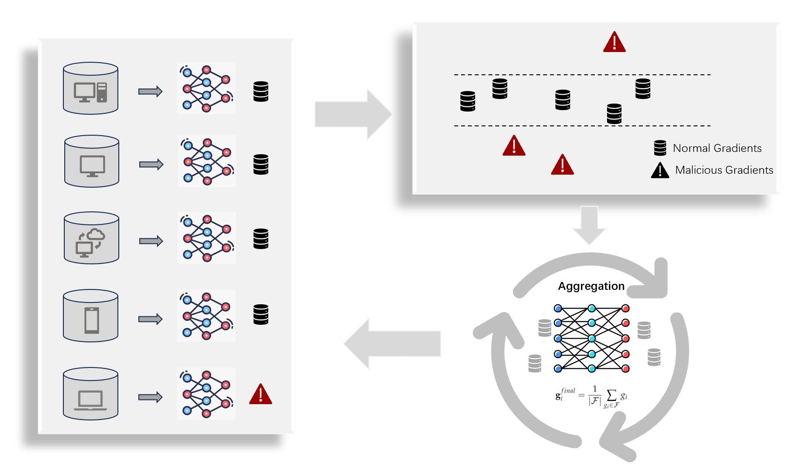

# Detection-of-Adversarial-Devices-using-ML

The project contains several steps:

1. Datasets: Raw data obtained from CICIoT2023, Edge-IIoT, TON-IoT and IoT23. The data are cleaned and formatted using scripts from pcap2csv folder.   

2. Intrusion Detection System(IDS) is set up through ML/DL models to do the classification task. Models include CNN, LSTM, CNN+LSTM, LSTM+CNN. Feature engineering includes Auto-Encoder and PCA.    
  
```
# If you want to test the trained model, for example: 
cd  models/classifiers/Generalization/
python test_lstm.py

# if you want to train the model, PCA for example:
cd  models/classifiers/PCA/
python LSTM_CNN.py
```

3. Adaptive Gradient Dimension Splitting with Federated Learning       
The proposed method is evaluated using both cyber-attack datasets and standard benchmarks (MNIST and CIFAR-10). It builds upon the [GAS algorithm](https://github.com/YuchenLiu-a/byzantine-gas), incorporating dimensionality reduction through PCA followed by K-means clustering. Mahalanobis distance is then employed for agnostic filtering of the clustered data. 

The general overview of the algorithm is shown below:


If you want to test with the IDS dataset, the cleaned and formatted can be obtained here: [IDS_Dataset](https://drive.google.com/drive/folders/1iqukGHlxjrnkI5ssvUDGxEEDrbOhz5PV?usp=sharing
)

```
cd AGDS
python main.py

# for baseline test
cd AGDS/baselines
python cifar10.py
python mnist.py
```